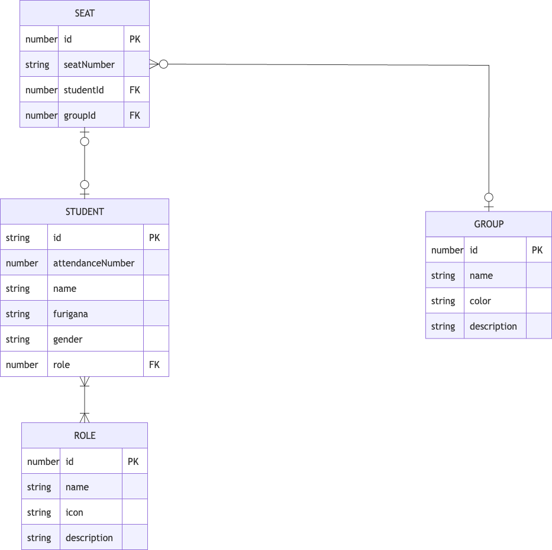

# 席替え支援Webアプリ「ラクガエ」 要件定義書

---

## 1. 目的とターゲット

### 1.1 アプリの目的

- 制約条件（生徒の特性、人間関係、班ごとの役割配分など）を満たした座席配置を自動算出し、**学校の先生やイベント運営者が座席表の作成・検討に費やす時間を極限まで削減する**こと。
- 完全ローカルで動作させ、個人情報（氏名や特性データ）を外部に漏らさず安全に利用できる環境を提供すること。

### 1.2 ターゲット層

1. **教員（メイン）**: 小学校・中学校・高校等で、生徒の視力や人間関係などの配慮をしながら定期的に席替えを行う先生。
2. **一般用途（サブ）**: 職場、大学、イベント運営、セミナー等で、特定の条件（役職や部署の分散など）に基づき座席を決定する必要がある担当者。

---

## 2. システムスコープ（境界）

### 2.1 In-Scope（対象範囲）

**【入力】**

- **参加者メタデータ**: 氏名、性別、ロール、特性タグなどの名簿データの取り込み（UI手入力、およびCSVインポート）。
- **座席空間の定義**: 座席の番号と設定データ（ゾーン・班など）の紐付け。どのような配置にするかはユーザー次第とする。
- **制約条件**: 個人への制約、複数人間の距離・関係制約、グループ構成に関する制約の指定。

**【出力】**

- **シャッフル結果・座席表の描画**: 教卓/運営側視点と、生徒/参加者側視点での座席表の可視化。
- **状態のローカルブラウザ表示**: 現在のレイアウトや設定状態の画面表示・保持。
- **エクスポート**: プロジェクトのバックアップ保存。名簿はCSVで取り込む。
- **印刷**: ブラウザの標準印刷で、座席表を A4 1枚に出す。見た目は生徒閲覧モードと同じ。選択中ならその範囲だけを、はみ出さない範囲でなるべく大きく刷る。

### 2.2 Out-of-Scope（対象外）

- 学習成績や出欠情報など、座席配置アルゴリズムに直接関与しない教務データ・機密データの保持および高度な分析機能。

---

## 3. 機能要件

### 3.1 生徒（参加者）管理機能

生徒（参加者）データの基本となるCRUD操作および属性管理を行う。

- **生徒の属性**:
  - **内部ID**: 登録時にシステムが自動付番する一意識別子。出席番号とは異なり不変であり、ロールやグループとの紐付けはすべてこの内部IDをキーとして行う。
  - **出席番号**: 手入力不可。UIリストの並び順によって自動付番される。
  - **名前**: 必須。
  - **ふりがな**: 任意。
  - **性別**: 「男性」「女性」「その他」から必須選択。
  - **ロール**: 任意の数だけ複数付与可能（重複不可）。付与されたロールの「内部ID」を保持して紐づける。
  - **グループ**: 任意の数だけ複数付与可能（重複不可）。付与されたグループの「内部ID」を保持して紐づける。

#### 3.1.1 名簿の取り込みとバックアップ:

- **名簿CSV**: UTF-8（BOM可）。必須列は `名前`。任意列は 出席番号, ふりがな, 性別, ロール。取り込み時は席の割り当て・生徒が絡む条件をクリアし、座席の配置とグループ定義は残す。名前が空の行はスキップして件数を出す。有効行が0ならエラーとし、状態は変えない。
- **バックアップ**: 内部プロジェクトの完全な状態をファイルとして保存・読み込む。読み込みは全置換。壊れているファイルは拒否し、現在の状態を残す。画面上では「バックアップファイル」と呼び、JSONという語は出さない。ツールバーの「インポート」が読み込み、「エクスポート」が保存。名簿CSVは生徒設定の「名簿を読み込む」からのみ。
- 旧来の設定CSVは名簿取り込みには使わない。バックアップにも使わない。

#### 3.1.2 出席番号ソート機能（名前順）:

生徒を名前順でソートし、出席番号を振り直す。ふりがなが入力されている生徒を五十音順に並べ、ふりがな未入力の生徒はその後ろにまとめる。

#### 3.1.3 出席番号変更機能（ドラッグ＆ドロップ）:

画面上の生徒カードリストをドラッグ＆ドロップで並び替えることで、その並び順通りに出席番号を自動で割り振る。

### 3.2 ロール管理機能

生徒に付与するための「ロール（例：学級委員、リーダー等）」のCRUD操作（作成・編集・削除）を行う。

- **ロールの属性**:
  - **内部ID**: 登録時にシステムが自動付番する一意識別子（出席番号とは異なるシステム内部管理用）。
  - **ロール名**: 必須。
  - **アイコン**: 必須。システム側で用意した10〜20種類程度のプリセットアイコン（Lucide等）からクリックで選択。
  - **説明文**: 任意。

### 3.3 グループ管理機能

生徒を所属させるための「グループ（例：A班、B班等）」のCRUD操作（作成・編集・削除）を行う。

- **グループの属性**:
  - **内部ID**: 登録時にシステムが自動付番する一意識別子（システム内部管理用）。
  - **グループ名**: 必須。
  - **カラー**: 必須。座席表等で視認しやすくするための色情報をプリセットから選択。
  - **説明文**: 任意。

### 3.4 座席管理機能

座席のCRUD操作を行う。

- **座席の属性**:
  - **内部ID**: 各座席を一意に特定する番号。
  - **生徒情報**: その座席に配置された生徒のデータ。（NULLの時は空席として扱う）
  - **グループ**: その座席が属するグループ情報（班など）。

### 3.5 座席設定機能

UI上のキャンバス（描画エリア）を用いて、直感的に座席表を編集・作成する機能。

#### 3.5.1 **座席配置のエディタ（キャンバス）機能**:

- Draw.ioのような操作感で、キャンバス上に長方形の「座席」オブジェクトや、任意の汎用オブジェクト（四角形、円形）を配置する。
- **ツールバー（左上UI）**: キャンバス左上のツールバーから以下の操作が可能。
  - 座席の追加
  - 汎用オブジェクト（四角形、円形）の追加（教卓、丸テーブル、障害物などの表現用）
  - テンプレートからのまとまった座席配置の追加
- **無限キャンバスとパン・ズーム・選択操作**:
  - **ツールバーによるモード切替**: キャンバス左上のツールバーから「選択ツール」と「手のひらツール（移動）」を切り替え可能。
  - **選択ツール時の操作**:
    - **左ドラッグ**: 範囲選択（マーキー選択）。ドラッグした青い枠に触れた座席やオブジェクトを複数選択する。
    - **`Ctrl` / `Cmd` ＋ 座席クリック**: 個別のオブジェクトを選択・解除する。
  - **手のひらツール時の操作**:
    - **左ドラッグ**: キャンバスの移動（パン）。
  - **ツール共通の移動（パン）ショートカット**:
    - `Space` キー ＋ 左ドラッグ
    - マウスの右ボタンドラッグ
    - トラックパッドの2本指スクロール（またはマウスホイール）
  - **ズーム操作**:
    - `Ctrl`（または`Command`）キーを押しながらマウスホイール（またはピンチ操作）でズームイン・アウト。
    - ズームの起点はマウスカーソルの位置となる。
    - キャンバス右下にズーム倍率（％）と「表示リセット」ボタンを表示し、クリックで100%・中央に戻る。
  - **削除操作**:
    - 選択状態で `Delete` または `Backspace` キーを押す。
    - 選択状態で右クリックし、コンテキストメニューの「削除」を選択する。
  - **コピー・複製・ペースト操作**:
    - 選択状態で `Ctrl` + `C`（Mac: `Cmd` + `C`）でコピー、`Ctrl` + `V`（Mac: `Cmd` + `V`）でペーストできる。
    - 複数選択してペーストした際は、相対的な配置（フォーメーション）を保ったまま、既存の座席・図形と重ならない空きスペースへ自動的に配置される。
    - 座席をコピー・複製した場合、割り当てられていた生徒情報はリセットされ「空席」として複製される。
- **グリッドスナップ**: 背景に細かいグリッド（x, y座標）を持ち、ドラッグによる座席の移動はそのグリッド幅単位でのみ行える。
- **追加・削除**: キャンバス上に新しい座席やオブジェクトを自由に追加したり、不要な座席を削除できる。
- **衝突判定（重なり禁止）**: ドラッグ＆ドロップで「座席」を移動させた際、他の座席と重なってしまう場合は配置を許可せず、自動的に「移動前の元の位置」へ戻る（※汎用オブジェクトは自由に重ねて配置可能）。
- **生徒情報のスワップ（入れ替え）**: **座席の上から「右クリック」でドラッグ**し、他の座席の上にドロップした場合は、両方の「座席の生徒情報」のみが入れ替わる（スワップされる）。※「座席ロック」状態の席が含まれる場合、このスワップ操作は失敗しトーストエラーが表示される。
- **空席と生徒の割り当て（ダブルクリック・右クリック）**:
  - 新規に配置された座席は生徒が割り当てられておらず「空席」扱いとなる。
  - **空席のダブルクリック / 右クリックから「生徒を割り当て」**: 座席のすぐ近くにポップオーバーが表示され、「新規生徒の登録（直接追加）」または「登録済みだが座席未配置の生徒」の一覧が表示される。ポップオーバー内の生徒をクリックすると、即座にその空席へ割り当てられポップオーバーが閉じる。
  - **生徒の割り当て解除**: 座席を右クリックしコンテキストメニューから「生徒の割り当て解除」を選択するか、座席を選択状態で `Alt + Delete`（Mac: `Option + Delete` / `Alt + Backspace`）を押すことで、座席を残したまま生徒を未配置に戻す。
  - **配置済み座席のダブルクリック**: 既に生徒が割り当てられている座席をダブルクリックした場合、右側の生徒設定パネル（SettingsPanel）が開き、生徒タブがアクティブになり、該当の生徒がリスト上でハイライトされ自動スクロールで表示される。
- **座席ロック機能**: 割り当て済みの座席を右クリックして「この座席をロック」にすると、生徒と座席が固定（紐付け）されシャッフル対象外・スワップ不可となる。ロックされた座席の左下には鍵アイコンが表示される。※空席に対してはロックの概念は存在せず、複製時にはロック状態は解除されて空席になる。
- **キャンバス背景のコンテキストメニュー（右クリック）**:
  - キャンバスの何もない背景部分を右クリックするとメニューが開き、クリックした位置に新しい座席を作成できる。
- **座席のコンテキストメニュー（右クリック）**:
  - 選択状態で右クリックすると、「生徒の割り当て解除（生徒配置時のみ）」「この座席をロック（生徒配置時のみ）」「グループを選択」「複製」「削除」等が実行できる。
- **汎用オブジェクトのコンテキストメニュー（右クリック）**:
  - 座席と同じ余白感（グリッドとの間に若干の隙間）を持つ四角形や円形のオブジェクト。選択状態で右クリックすると「複製」「削除」が実行できる（「グループを選択」などの座席用メニューは非表示）。

#### 3.5.2 **テンプレート機能**:

- ゼロから座席を配置する手間を省くため、複数の座席やオブジェクトがセットになったテンプレートをツールバーからワンタッチで配置できる。
- 提供するテンプレート例:
  - **教室 (7x6)**: 標準的な教室レイアウトと教卓。
  - **多目的室**: 島型の4人席が散らばったレイアウト。
  - **修学旅行 (バス)**: 2列・通路・2列のレイアウト。
  - **4人席 / 6人席**: 班ごとのまとまった座席。
  - **円卓**: 円形のオブジェクトと、その周囲に配置された座席。

#### 3.5.3 **初期データ（初回アクセス・LocalStorage未設定時）**:

- **目的**: 初回アクセス時に白紙画面で戸惑うことなく、すぐに席替え機能の利便性を体感できるようにする。
- **構成**:
  - **座席配置**: 2人ペア×3列、5行（計30席）＋ 前面中央に「教卓」オブジェクトを配置。
  - **生徒データ**: 30人分のサンプル生徒（「あ太郎」「あ花子」〜「そ花子」など、五十音順でモックとひと目で分かるダミー名、男女各15名、出席番号1〜30番、ふりがな付き）。
  - **ロール**: 「班長（Crown）」「副班長（Star）」の2種類。
  - **グループ**: 「1班」〜「6班」および「前方配慮（視力等）」の計7グループ。
  - **制約条件**: 「生徒-生徒制約（あ太郎・あ花子を離す）」「グループ-性別条件（1〜6班の男子各2人以上）」「グループ-性別条件（1〜6班の女子各2人以上）」「グループ-役割条件（1〜6班の班長各1人以上）」「生徒-グループ条件（き花子を前方配慮グループに配置）」の計5つのサンプルを設定。
  - **データ管理機能（全体設定タブ）**:
    - **初期サンプルを復元**: いつでも初期の30人学級サンプル構成を再ロードできる。
    - **データを全消去（空にする）**: すべての座席・生徒・役割・グループ・制約をリセットし、完全な空白キャンバス状態にする。

#### 3.5.4 **UI上の座席表示情報とデザイン**:

- 生徒の出席番号、生徒の名前とふりがな、グループの色、生徒のロールアイコン、およびロックアイコンを表示する。
- **座席の色**: 割り当てられたグループの色で表示される。複数グループが選択されている場合は、最初に選択されたグループの色が優先して表示される。

### 3.6 制約管理機能

制約のCRUD操作を行う機能。以下の5種類の制約を指定できる。
各種制約の適用をON/OFFすることができ、ONの条件を制約条件としてランダムシャッフルすることができる。

1. **生徒-座席制約【ハード制約】**: 特定の生徒1人を、特定の1つの座席に完全に固定する。この制約は計算時に必ず守られる絶対条件となる。
   - **用途例**: 視力が悪いため必ず一番前の席にしたい生徒を固定する。
2. **生徒-生徒条件【ソフト制約】**: 対象の2人の生徒を「近づける（同じ班に配置）」または「遠ざける（違う班に配置）」。
   - **用途例**: 仲が良くなくトラブルになりがちなAさんとBさんを「別の班」にする。あるいは、サポートが必要なCさんと世話焼きのDさんを「同じ班」にする。
3. **生徒-グループ条件【ソフト制約】**: 指定した生徒を、特定のグループ（複数選択可）に「所属させる（入れる）」または「所属させない（入れない）」。
   - **用途例**: Aさんを「1班か2班のどちらか」に絶対に入れたい場合や、逆に「3班と4班」には絶対に入れたくない場合。
4. **役割/性別のグループ条件【ソフト制約】**: 指定した役割や性別を持つ生徒を、特定のグループ（複数選択可）に「N人以上」入れる。
   - **用途例**: 掃除当番の都合上、「A班とB班」には「力仕事ができる役割（例: 体育委員）」の生徒をそれぞれ「2人以上」必ず配置したい場合。

※**制約の優先度**: 1の「生徒-座席制約」は絶対条件（ハード制約）として必ず守る。2〜4の制約は「なるべく守る（ソフト制約）」として扱う。ソフト制約同士が競合したり均等割り当てで余りが生じたりした場合でもエラーとせず、可能な限り条件を満たす（ペナルティの少ない）配置結果を返す。

### 3.7 最適化シャッフル機能

定義されたデータと制約を元に、座席配置を自動算出する機能。

- **実行と演出**: 生徒に結果を見せるためのアニメーション付きシャッフル。BGMはない。
- **演出のテスト実行（プレビュー）**: 全体設定で、現在のアニメーションだけを再生して確認する。最適化計算や座席の変更はしない。プレビュー中に設定を変えると再生は止まる。一時停止とスキップはない。
- **計算方針とフィードバック**: ハード制約（座席固定）を満たした上で、それ以外の条件は全てソフト制約として評価するため、条件競合による計算エラー（シャッフル失敗）は発生せず必ず結果を出力する。制約を満たしきれなかった部分がある場合は、シャッフル結果画面で「どの条件が満たせなかったか」をユーザーに簡潔にフィードバックする。

### 3.8 可視化・エクスポート・印刷機能

算出された結果や現在の設定状態を出力・保存する機能。

- **表示視点の反転（画面）**: 「教卓・運営者視点（画面上部が前方）」と「生徒・参加者視点（上下左右が反転）」のワンタップ切り替え。これは画面上の操作である。印刷の氏名 180° 回転（後述）とは別機能であり、印刷処理はこのフラグを読まない・書き換えない。
- **印刷**: 先生が A4 に座席表を出し、教室の壁に貼るか、机の上で配置を確認する。見た目は生徒閲覧モードと同じ（座席の文字と図形。班色・ロールは出さない）。キャンバスで複数選択しているときは、選んだ座席・図形だけを用紙いっぱいに出す。ブラウザの標準印刷ダイアログだけを使う。印刷面は編集キャンバスの複製ではない。詳細は 3.8.1 以降。実装の境界は `docs/print-design.md`。

#### 3.8.1 印刷の開始

- フッタの「印刷」（`#btn-footer-print`）を押すと印刷設定を表示し、用途を選んでからブラウザの標準印刷画面を開く。
- 印刷設定は次の 2 種類。初期値は「掲示用」。
  - **掲示用（文字を正立）**: 教室の壁に貼る。前方（教卓側）が上、座席の文字は正立。
  - **机上確認用（文字を 180° 回転）**: 机に置いて向かい側から読む。座席と図形の位置は変えず、各座席の文字と図形上の文字をそれぞれの枠の中心で 180° 回す。
- 設定画面で用紙向きを「A4 横」または「A4 縦」から選ぶ。初期値は「A4 横」。選んだ向きの余白内に、印刷対象を収まる最大倍率で中央配置する。
- `Ctrl` / `Cmd` + `P`、およびブラウザメニューからの印刷では、同じタブ内で最後に確定した設定を使う。未確定なら「掲示用」と「A4 横」。印刷対象（全体か選択範囲か）は、ダイアログを開いた時点のキャンバス選択に従う。
- 座席も図形も 1 つもないときは印刷設定を開かず、印刷できるものがないことを通知する。
- 印刷設定は同じタブを開いている間だけ保持する。LocalStorage、バックアップ、教室データには保存しない。

#### 3.8.2 印刷対象（全体 / 選択範囲）

- キャンバスで座席・図形が **1 つも選ばれていない** ときは、キャンバス上のすべての座席と図形を印刷する。
- **1 つ以上選ばれている** ときは、選ばれている座席と図形だけを印刷する。マーキー（ドラッグ）や複数選択で選んだ範囲が対象になる。相対的な配置は保ったまま、その外接範囲だけを用紙いっぱいに拡大する。
- 選択枠・マーキーの青枠・リサイズつまみは印刷しない。
- 画面のパン位置・ズーム倍率には依存しない。印刷の前後でパン・ズーム・選択は変わらない。

#### 3.8.3 用紙と配置

- 1 枚の A4 に出す。見た目の余白は上下左右 10mm。用紙の `@page` 余白は 0 にし、ブラウザが左下の URL と右下の日付を置く隙間を作らない。10mm は印刷面の内側余白として取る。複数ページへの分割はしない。
- 印刷対象の外接範囲を、設定で選んだ A4 縦または A4 横の余白内に収まる最大倍率で出す。向きを変えてもはみ出さない。
- 外接範囲全体を余白内の中央に置く。画面の表示リセットにある 100% 上限は印刷には適用しない。小さい範囲（選択した数席など）は拡大し、大きい範囲は 1 枚に収まるまで縮小する。はみ出しは禁止する。
- 座席の文字は枠内に収まるよう席ごとに大きさを下げ、省略記号（…）では切らない。
- ブラウザの印刷ダイアログで余白を広げられた場合は、印刷対象全体を縮小して 1 枚に収める（切れない）。
- 画面幅 390px を含むコンパクト表示でも、画面幅ではなく A4 の寸法を基準に同じ結果を出す。

#### 3.8.4 印刷する内容（生徒閲覧モードと同じ）

紙の見た目は **生徒閲覧モード（3.9）のキャンバス** に合わせる。いま画面が編集モードでも、印刷のために閲覧へは切り替えない。

- **座席**: 枠、出席番号、ふりがな（未入力なら空行）、氏名。空席は「空席」。
- **図形**: 四角形・円形の本体と、図形上の文字（教室テンプレートの「教卓」など）。教卓などの位置の目印として残す。
- **出さないもの**: ロールアイコン、グループ色（塗り・ドット）、ロックアイコン、選択枠、リサイズつまみ、グリッド、ヘッダー／フッタ／設定／ツールバー／ズーム HUD、トースト、ツアー、シャッフル演出、モーダル、コンテキストメニュー、割り当てポップオーバー、見出し（「ラクガエ 座席表」）、日付、クラス名、凡例。
- 「机上確認用」では座席の文字（出席番号・ふりがな・氏名・「空席」）と図形上の文字（「教卓」など）を、それぞれの枠の中心で 180° 回転する。座席と図形の位置は回さない。座席表全体を 180° 回す選択肢は設けない。

#### 3.8.5 プライバシーと出力方式

- 印刷処理は完全にブラウザ内で行い、氏名や座席情報を外部へ送信しない。
- PDF 生成ライブラリやアプリ独自の PDF 出力は追加しない。出力先の選択はブラウザの標準印刷画面に委ねる。
- 検証はネイティブの印刷ダイアログを開かない。印刷メディアのエミュレーションで、画面シェルが消え、印刷用の座席表だけが見え、対象の座席・図形が用紙内にあり、閲覧モードで出る文字（氏名・「空席」・「教卓」）が見え、ロール／グループ色／見出しが出ず、印刷前後でズーム表示と選択が変わらないことを確認する。選択ありのときは、選んでいない座席・図形が印刷面に無いことも確認する。

#### 3.8.6 対象外

- 座席表全体の回転、画面上の視点切り替えを印刷で代用すること、用紙サイズ・余白の手動指定、複数ページ、タイル印刷、アプリ内印刷プレビュー。
- 編集モードの班色・ロール・ロックを紙に出すこと、見出し・日付・クラス名の追加。
- A4 以外の用紙、PDF / Excel ライブラリ、サーバー経由の印刷・共有、印刷設定の永続化。
- 利用者が標準印刷画面で用紙・倍率・余白を変えた場合はアプリの制御対象外とする（余白を広げられた場合の縮小は 3.8.3）。既定の「ヘッダーとフッター」（左下 URL・右下日付）は `@page` 余白 0 で出さない。

### 3.9 モード切替機能（編集 / 生徒閲覧モード）

アプリ全体の画面表示・アクセス権限を「編集モード」と「生徒閲覧モード」で切り替える機能。

- **編集モード**: 先生（管理者）が利用する通常モード。すべての設定画面へアクセス可能で、座席表上の情報（ロールアイコン、グループ色）もすべて表示される。
- **生徒閲覧モード**: 生徒に画面を見せながらシャッフルを行う際のモード。
  - **アクセス制限**: 各種設定画面（生徒管理、グループ管理、制約設定など）への画面遷移を無効化（またはメニュー非表示）する。
  - **表示の制限**: 座席表上において、生徒の「ロールアイコン」および「グループの色」を非表示にする（配慮事項や内部ルールを生徒から隠すため）。
  - **シャッフルの実行**: 設定画面は使えないが、「シャッフル実行」ボタンはそのまま使用可能とし、演出を交えて座席決定の様子を生徒に見せることができる。

### 3.10 オンボーディング・使い方ガイドハブ機能

初回利用者および操作方法を振り返りたいユーザー向けに、直感的な体験ツアーと機能別ガイドハブを提供する機能。

#### 3.10.1 対象と開始トリガー

- **初回アクセス時**:
  - LocalStorageにオンボーディング完了フラグ（`hasCompletedOnboarding`）が存在しない場合、自動的に画面中央に「ようこそモーダル（3分実践ツアーを開始 / スキップ）」を表示する。
- **手動開始（常設）**:
  - ヘッダー右側に「🔰 はじめてガイド」ボタンを常設。クリックすると「ガイドハブ（各種操作ガイド＆ツアー開始）」モーダルが表示される。
  - ユーザーが既に名簿や座席を編集している状態でツアーを開始しようとした場合、「初期サンプルデータを読み込んでガイドを開始しますか？」という確認ダイアログを表示し、承諾後に初期ツアーデータをロードしてツアーを開始する。

#### 3.10.2 3分間実践インタラクティブツアー（丁寧な導入7ステップ）

対象UI要素をスポットライトで強調し、ユーザーが実際にアプリを操作しながら一通りの機能を体験する実践型ステップ。

- **ステップ1（テンプレートから座席を配置）**: ツールバーの「テンプレート」をクリックし、「教室（7×6）」を選択して30席と教卓をキャンバス上に配置する。
- **ステップ2（生徒を1名追加登録）**: 生徒設定タブで、残り1名の生徒（30人目「そ花子」など）を入力して「生徒を追加」する。
- **ステップ3（名簿を名前順に整列）**: 名簿の「名前順ソート」ボタンをクリックし、出席番号を五十音順に整列する。
- **ステップ4（6班の登録と割り当て）**: グループタブで「6班」を追加し、座席グループを設定する。
- **ステップ5（前方配慮の条件を設定）**: 条件タブで、視力配慮が必要な生徒を最前列の「前方配慮（視力等）」グループに配置する条件を追加・有効化する。
- **ステップ6（シャッフルを実行）**: フッターの「シャッフル実行」ボタンをクリックし、設定条件を満たした自動座席配置の算出・反映を体験する。
- **ステップ7（生徒閲覧モードで確認＆完了）**: フッター右下の「閲覧」スイッチをクリックして生徒閲覧モードへ切り替え、完了お祝いモーダルを表示する。
- **UIコントロール＆操作連動**:
  - ステップ進捗表示（`1 / 7`）
  - 操作指示ヒント（「👉 [操作] を実行してください」）
  - 実際の操作完了検知（操作達成時に「✨ 操作完了！」を表示しスムーズに進行）
  - 「前へ」「次へ」「スキップ（✕）」ボタン

#### 3.10.3 操作振り返り・機能別ガイドハブ（モーダル内タブ＋GIF/アニメーション表示）

ヘッダーの「🔰 はじめてガイド」ボタンから開くモーダル内で、いつでも操作を振り返ることができる。

- **UI構成**:
  - **左側（カテゴリ別・アコーディオン形式のやりたいことメニュー）**:
    - **まずはここから**
      - 3分実践ツアーを始める（最上部に目立たせて配置）
    - **1. 座席のレイアウト**
      - 座席を配置したい
      - 座席をまとめて移動させたい
      - 生徒を席に割り当てたい
      - 生徒を入れ替えたい
      - 特定の生徒の席を固定したい
      - 座席にグループを割り当てたい
    - **2. 生徒・名簿の管理**
      - 生徒を登録/変更/削除したい
      - 名簿のインポート/エクスポートがしたい
      - 生徒を名前順に整列させたい
    - **3. 条件・制約の指定**
      - 役割を登録したい
      - グループを登録したい
      - 班ごとに班長を必ず1人割り当てたい
      - 目が悪い人を前の座席に置きたい
      - 特定の生徒を離したい
    - **4. シャッフルと共有**
      - 生徒に設定を見られずに、席替え用のシャッフルを見せたい
      - シャッフルアニメーションを変更したい
  - **右側（プレビュー・説明エリア：縦積みレイアウト）**:
    - **上部**: 各操作を示す動画エリア（動画素材は後から挿入できるよう空の枠のみを用意する）
    - **下部**:
      - ステップバイステップの操作手順（1. 〇〇を開く、2. 〇〇をクリック...）
      - ヒント・キーボードショートカット一覧
    - （「3分実践ツアーを始める」選択時のみ、「3分ツアーを開始」ボタンを大きく表示）

### 3.11 開発者支援・寄付機能

教育現場向けに完全無料で提供されている「ラクガエ」の継続的な保守、サーバー維持費、および新機能開発を支援するため、応援・寄付機能を提供する。
メインの席替え操作画面（ヘッダー・フッター・キャンバス）には配置せず、「設定（全体設定）パネル」の最下部にシンプルに配置する。

- **配置場所**: 設定パネル > 全体設定（設定タブ）の最下部
- **リンク先**: 開発者支援ページ（`https://ofuse.me/o?uid=218335`）
- **デザイン仕様**:
  - ラクガエのブランドトーン＆マナー（温かみのあるパステルイエロー系、角丸、Zen Maru Gothicフォント）に最適化した専用カードおよびボタンを配置
  - プラットフォーム名の明記や不要な注釈・コピーボタンを省き、先生方が気兼ねなく応援・寄付できるすっきりとしたUI
  - ボタンはアプリ内の `.btn-primary` リンク（Heart / ExternalLink アイコン、文言「応援メッセージ・寄付を送る」）。Ofuse 公式 `widget.js` は読み込まない

---

## 4. データ設計（内部データ構造）

本アプリはDBを使わず、ブラウザの Zustand と LocalStorage で状態を持つ。

モジュールの向きは次のとおり。下の層は上の層を import しない。

1. **types**: エンティティおよびドメインモデルの型。`src/types/` 配下に明示的ファイル（`student.ts`, `seat.ts`, `canvas.ts`, `print.ts`, `backup.ts`, `roster.ts`, `icon.ts`, `template.ts`, `animation.ts` 等）で定義。
2. **services**: 席替え・名簿CSV・バックアップ・班割当・印刷レイアウト・幾何計算などのドメインロジック・純粋関数。`src/services/`（`shuffle.ts`, `roster.ts`, `autoAssign.ts` など）。React コンポーネントを import しない。
3. **stores**: Zustand。教室データは `src/stores/appStore.ts`。オンボーディング・トースト・クリップボードは別ストア。印刷セッション（`printSession.ts`）も別ストアとし、LocalStorage には保存しない。Slice 分割はしない。
4. **hooks**: 共通フックは `src/hooks/`、特定機能固有のフックは各コンポーネント配下（例: `src/components/canvas/hooks/`）に配置（コロケーション）。ストアと services を画面操作に繋ぐ。
5. **components / views**: 描画。`App.tsx` はレスポンシブな `MainView` を描画。プレゼンテーション層として純粋なUI描画に専念。

`optimizeShuffle` はメインスレッドで動き、探索は最大 300ms で打ち切る。Web Worker は使わない。名簿CSVは `src/services/roster.ts` の手書きパーサで、Excel 用ライブラリは入れない。プロジェクトの引き継ぎは `src/services/backup.ts`。応援導線は全体設定タブの Ofuse リンクだけである。アプリ内寄付モーダルはない。

### 4.1 データモデル設計

Zustandで管理する主要なエンティティ（状態）。正規化（Normalization）を意識し、IDベースで紐付ける。

**1. Student (生徒/参加者)**

- `id`: string (一意な内部ID)
- `attendanceNumber`: number (出席番号・UI上の並び順)
- `name`: string (氏名)
- `furigana`: string | null (ふりがな)
- `gender`: 'male' | 'female' | 'other' (性別)
- `roleIds`: string[] (付与されたロールのIDリスト)
- `groupIds`: string[] (付与されたグループのIDリスト)

**2. Role (ロール/役割)**

- `id`: string (一意な内部ID)
- `name`: string (ロール名)
- `iconName`: string (Lucide等のアイコン識別名)
- `description`: string | null

**3. Group (グループ/班)**

- `id`: string (一意な内部ID)
- `name`: string (グループ名)
- `color`: string (プリセットカラー識別子)
- `description`: string | null

**4. Seat (座席・キャンバス上のオブジェクト)**

- `id`: string (一意な内部ID)
- `studentId`: string | null (配置されている生徒ID。nullなら空席)
- `groupIds`: string[] (この座席が属するグループIDのリスト)
- `x`: number (キャンバス上の抽象的なXグリッド座標・列)
- `y`: number (キャンバス上の抽象的なYグリッド座標・行)
- `isLocked`: boolean (生徒-座席制約【ハード制約】のフラグ。trueの場合、シャッフル対象外およびスワップ不可となる)

**5. CanvasObject (汎用オブジェクト)**

- `id`: string (一意な内部ID)
- `type`: 'rectangle' | 'circle' (図形のタイプ)
- `x`: number (キャンバス上のXグリッド座標)
- `y`: number (キャンバス上のYグリッド座標)
- `width`: number (グリッド単位の幅)
- `height`: number (グリッド単位の高さ)

**6. Constraint (制約条件)**
※ハード制約はSeatの`isLocked`で管理するため、ここではソフト制約を中心に定義。

- `student-student` (生徒-生徒条件): `id`, `studentId1`, `studentId2`, `matchType ('close' | 'far')`, `isEnabled`
- `student-group` (生徒-グループ条件): `id`, `studentId`, `groupIds`, `matchType ('include' | 'exclude')`, `isEnabled`
- `group-match` (役割/性別のグループ条件): `id`, `targetType ('role' | 'gender')`, `targetId`, `groupIds`, `minCount`, `isEnabled`

**7. AppState (アプリ設定・UI状態)**

- `viewMode`: 'edit' | 'student_readonly' (編集モード / 生徒閲覧モード)
- `perspective`: 'teacher' | 'student' (教卓視点 / 生徒視点)。画面上の表示視点。印刷の氏名向きとは別であり、印刷の状態には含めない。
- 印刷の一時設定（掲示用 / 机上確認用、A4 横 / A4 縦）は AppState・persist・バックアップの対象外。独立した非永続ストアで持つ。

### 4.2 エンティティのリレーションシップ（ER図）

---

## 5. 非機能要件

### 5.1 パフォーマンス

- **計算レスポンス**: 貪欲法等をベースとしたアルゴリズムにより、40〜50人規模の複雑な制約計算であっても**最大10秒以内**に結果を返す（あるいは不可能の判定を下す）こと。
- **UIレスポンス**: 画面の切り替えやドラッグ＆ドロップによる微調整操作において、体感的な遅延（カクつき）が発生しないこと。

### 5.2 セキュリティ・プライバシー

- **完全ローカル完結**: 参加者の氏名、性別、配慮事項等の機密情報は、ネットワークを通じて一切外部サーバーに送信されないアーキテクチャ（LocalStorageを用いた永続化）を厳守する。

### 5.3 技術スタック（指定）

- **開発・実行環境**: Node.js v24系 (v24.9.0)
- **言語**: TypeScript v7系 (v7.0)
- **UIライブラリ**: React v19系 (v19.2)
- **ビルドツール**: Vite v8系 (v8.2)
- **スタイリング**: Vanilla CSS (標準CSS / CSS Modules)
- **状態管理**: Zustand v5系 (v5.0)
